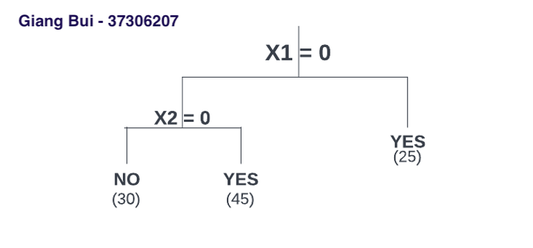
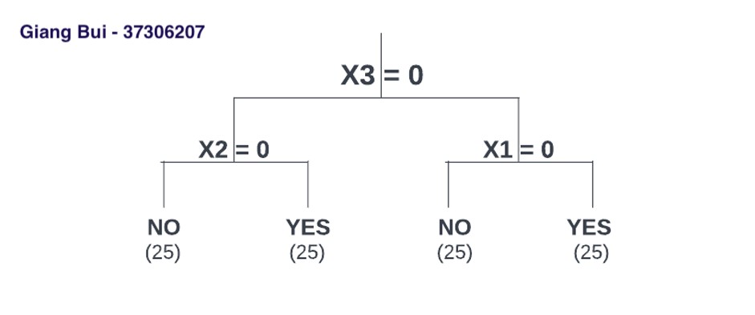
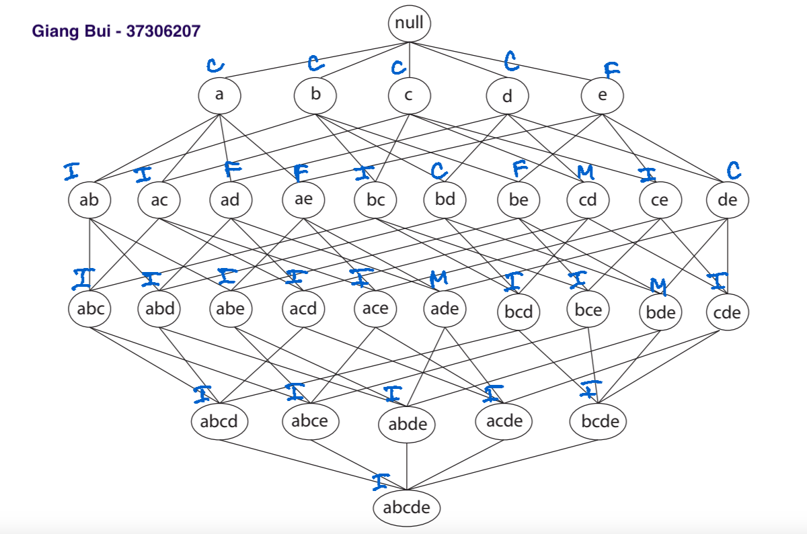
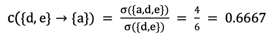
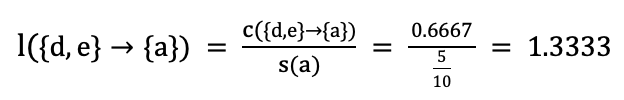

```{r include=FALSE}
knitr::opts_chunk$set(include = TRUE)
library(grid)
# Create a text
grob <- grobTree(textGrob("Giang Bui", x=0.1,  y=0.95,
  gp=gpar(col="red", fontsize=13, fontface="italic")))
# Plot
# sp2 + annotation_custom(grob)
```

# QUESTION 1:
## (a) Manually grow a depth two CART tree using Gini Index:
We create functions to calculate gini for each branch of split and weighted gini for both split as below

```{r}
#Create function calculating gini index
gini <- function(yes, no) {
  n = yes + no
  return(yes/n * (1-yes/n) + no/n * (1-no/n))
}
# Create function calculating weighted sum of gini of the split:
weighted_gini <- function(num_1, num_2, gini_1, gini_2) {
  num = num_1 + num_2
  return(num_1/num * gini_1 + num_2/num * gini_2)
}
```

Calculating Gini impurity score for data set in 4 cases: without splitting, splitting at X1=0, splitting at X2=0 or X3=0:

```{r}
# Calculating Gini index for data set without spliting:
whole_gini = gini(50, 50)
# Gini index for data set when spliting at X1= 0:
gini_x1 = weighted_gini(25, 75, gini(25, 0), gini(25, 50))
# Gini index for data set when spliting at X2=0:
gini_x2 = weighted_gini(50, 50, gini(30, 20), gini(20, 30))
# Gini index for data set when spliting at X3=0:
gini_x3 = weighted_gini(50, 50, gini(25,25), gini(25, 25))
cat("Gini index without splitting:", whole_gini,"\n")
cat("Gini index when splitting at X1=0:", gini_x1, 
    ". Reduction of impurity = ", whole_gini - gini_x1, "\n")
cat("Gini index when splitting at X2=0:", gini_x2,
    ". Reduction of impurity = ", whole_gini - gini_x2, "\n")
cat("Gini index when splitting at X3=0:", gini_x3,
    ". Reduction of impurity = ", whole_gini - gini_x3, "\n")
```

Without splitting, Gini impurity score is 0.5. 
If we split at X1=0, the Gini index is 0.333 with impurity reduction of 0.167. 
If we split at X2=0, the Gini index is 0.480 with impurity reduction of 0.020. 
If we split at X3=0, the Gini index is 0.500 with impurity reduction of 0.000. 
Conclusion, the best split is at X1 = 0, because when splitting at X1, the data set impurity  reduced the most with 0.167.

## (b) Two daughter nodes found in part (a):

Let's examine the right branch's Gini index (X1 != 0):

```{r}
gini_right = gini(25,0)
cat("Gini index at right branch of X1=0 node = ", gini_right,"\n")
```

Gini impurity score for right branch of X1 = 0 node is 0, which mean this branch is pure and all results will be classified as 'Yes'. We repeat part (a) for the left branch (X1 = 0):

```{r}
# Gini index of left branch without splitting:
gini_left = gini(25,50)
# Gini index of left branch if we split at X2 = 0 :
left_gini_x2 = weighted_gini(45, 30, gini(25, 20), gini(0, 30))
# Gini index of left branch if we split at X3 = 0 :
left_gini_x3 = weighted_gini(25, 50, gini(0,25), gini(25, 25))
cat("Gini index of left branch without splitting:", gini_left,"\n")
cat("Gini index of left branch when splitting at X2=0:", left_gini_x2 , 
    ". Reduction of impurity = ", gini_left - left_gini_x2, "\n")
cat("Gini index of left branch when splitting at X3=0:", left_gini_x3 , 
    ". Reduction of impurity = ", gini_left - left_gini_x3, "\n")
```

At the left branch of X1=0 node, Gini impurity score without splitting is 0.4444
If we split this branch at X2=0, the Gini impurity score is 0.2963 with impurity reduction of 0.1481
If we split the left branch at X3=0, the Gini impurity score is 0.3333 with impurity reduction of 0.1111 
Conclusion, the best split for left branch of X1 = 0 node is at X2 = 0, because the impurity reduction value is bigger (0.1481) than that of X3 = 0 (0.1111).

Sketch the resulting tree
 
```{r}
 
```

## (c) How many training observations are misclassified in your tree?

```{r}
gini_left_X2 = gini(0,30)
gini_right_X2 = gini(25,20)

cat("Gini index of left branch of X2 = 0 node is: ", gini_left_X2,"\n")
cat("Gini index of right branch of X2 = 0 node is: ", gini_right_X2,"\n")

```

As we can see, Gini index of the left branch of X2 = 0 node is 0, which means this branch is pure, so no misclassification happens here.
Meanwhile, the right branch's gini index is 0.4938272.This branch includes 25 'Yes' and 20 'No'. If we stop splitting for this branch and label this branch as 'Yes' (because more 'Yes' observation than 'No'),  we will misclassify 20 observation 'No' as 'Yes'.

## (d) Grow a tree with a depth two using the same method as above, but use X3 to split the root node. Sketch the resulting tree. 

The root split is at X3 = 0, we repeat and calculate the gini index in two case: splitting at X1 and splitting at X2:

```{r}
#Gini index of left branch of X3 = 0 node:
## If we split at X1 = 0 :
gini_x1 = weighted_gini(0, 50, 0 , gini(25, 25))
## If we split at X2 = 0 :
gini_x2 = weighted_gini(25, 25, gini(25,0), gini(0, 25))
cat("Gini index of left branch when splitting at X1=0:", gini_x1 , "\n")
cat("Gini index of left branch when splitting at X2=0:", gini_x2 , "\n")

```

As we can see, on the left branch of X3=0 node, we decide to split at X2=0, because its gini index is 0.
```{r}
#Gini index of right branch of X3 = 0 node:
## If we split at X1 = 0 :
gini_x1 = weighted_gini(25, 25, gini(0,25), gini(25, 0))
## If we split at X2 = 0 :
gini_x2 = weighted_gini(25, 25, gini(20,5), gini(5, 20))
cat("Gini index of right branch when splitting at X1=0:", gini_x1 , "\n")
cat("Gini index of right branch when splitting at X2=0:", gini_x2 , "\n")
```

As we can see, on the right branch of X3=0 node, we decide to split at X1=0 node, because the its gini index is 0.

Sketch the resulting tree
 
```{r, fig.cap="A caption", out.width = '100%'}

```

## (e)	Use parts (c) and (d) to conclude about the greedy nature of CART. 

In sub-quesiton (c), the data set is divided using the greedy approach (recursive binary splitting). By calculating the Gini impurity score for each option and choosing the one which lowest Gini value as the node for splitting and keep going until the count is less than a certain threshold. It is greedy because when we set the depth is 2, the tree will misclassify a number of observations, while in sub-question (d), the root node at X3=0 is optimal for growing a 2-depth tree.

# QUESTION 2:

Fit classification trees to predict the region of origin using the Auto data. X is not a variable so we remove the column X. We also remove 'name' variable. 
```{r}
# install.packages("knitr")
library(knitr)
library(tree)
library(MASS)
#setting Work Directory:
# setwd('~/Desktop/STAT462_Assignment2')
# getwd()
#Read the AutoTrain.csv and AutoTest.csv files:
auto.train = read.csv('AutoTrain.csv', header = TRUE, na.strings = "?")
auto.test = read.csv('AutoTest.csv', header = TRUE, na.strings = "?")
#remove X and name variables
auto_train = subset(auto.train, select = -c(X,name))
auto_test = subset(auto.test, select = -c(X,name))
# "origin" variable type is converted from 'int' to 'factor', 
# and labelled as 1 = US, 2 = Europe and 3 = Asia
auto_train$origin <- factor(auto_train$origin, 
                            levels = c(1,2,3), 
                            labels = c("US", "Europe", "Asia"))
auto_test$origin <- factor(auto_test$origin, 
                            levels = c(1,2,3), 
                            labels = c("US", "Europe", "Asia"))
```

## (a) Fit a model using trees for auto_train data set, then we summary and plot the result:

```{r}
tree.auto=tree(origin~.,auto_train)
plot(tree.auto)
title(main = "Classification Tree For Training Data Set", 
      sub = "Giang Bui - 37306207", cex.sub = 0.75, col.sub = "blue")
text(tree.auto,pretty=0)
tree.auto
summary(tree.auto)
```

Interpret the result from the summary:
- There are 5/7 variables are involved: 'displacement', 'horsepower', 'mpg', 'year', 'acceleration'. Another two variables which were not involved including 'cylinders', 'weight'.
- Misclassification error rate of the result is 0.1071
- Looking at the plot, we can see "displacement" is the most important variable which feature the root node and appeared many times in the tree. "horsepower" and "mpg" are also important variables in tree model.
- There are totally 13 terminal nodes, which present the predicted classification of origin.
The original tree looks bushy which might because of data overfitting.

The test and training misclassification errors for the tree:

```{r}
# training error
set.seed(1234)
tree.pred_train=predict(tree.auto,auto_train,type="class")
CM_train <- table(tree.pred_train,auto_train$origin)
kable(CM_train, caption = "Confusion matrix for training set: ")
CM_accuracy_train <- sum(diag(CM_train))/sum(CM_train)
misclass.error_train <- 1-CM_accuracy_train
# testing error
set.seed(1234)
tree.pred_test=predict(tree.auto,auto_test,type="class")
CM_test <- table(tree.pred_test,auto_test$origin)
kable(CM_test, caption = "Confusion matrix for test set: ")
CM_accuracy_test <- sum(diag(CM_test))/sum(CM_test)
misclass.error_test <- 1-CM_accuracy_test
cat("Training Misclassifications error = ", misclass.error_train,"\n")
cat("Test Misclassifications error = ", misclass.error_test,"\n")
```

Misclassifications error for training dataset is 0.1071429, which is pretty good. However, Misclassifications error for test dataset is 0.3112245, which is pretty high, which can be explained that the complex tree overfitted the data. 

## (b) Use the cv.tree() R function to prune your tree (use your judgement here). Does the pruned tree perform better?

```{r}
set.seed(1234)
cv.auto=cv.tree(tree.auto,FUN=prune.misclass)
cv.auto
summary(cv.auto)
plot(cv.auto$size,cv.auto$dev,type="b")
title(main = "Relationship Between Size Of Tree And Deviance", 
      sub = "Giang Bui - 37306207", cex.sub = 0.75, col.sub = "blue")
```

The graph above shows relationship of deviance and number of terminal nodes. when the terminal nodes are pruned back from 13 to 5, the deviance varied slightly. If the terminal nodes number are less than 5, the deviance started increasing dramatically as the tree becomes too shallow, which means the misclassification error also increase quickly. Therefore, 5 terminal nodes are the simpliest (good for interpretation) with low deviance value, which prevents the overfitting result, and and perform with low misclassification error value. 

Pruning the tree to 5 terminal nodes, and calculate training and testing misclassification error  as the code below:

```{r}
prune.auto=prune.misclass(tree.auto,best=5)
plot(prune.auto)
title(main = "Prunned Tree With Terminal Nodes = 5", 
      sub = "Giang Bui - 37306207", cex.sub = 0.75, col.sub = "blue")
text(prune.auto,pretty=0)
# training misclassification error
set.seed(1234)
prune_tree.pred_train=predict(prune.auto,auto_train,type="class")
prune_CM_train <- table(prune_tree.pred_train,auto_train$origin)
kable(prune_CM_train, caption = "Confusion matrix for training set:")
prune_CM_accuracy_train <- sum(diag(prune_CM_train))/sum(prune_CM_train)
prune_misclass.error_train <- 1-prune_CM_accuracy_train
# testing error
set.seed(1234)
prune_tree.pred_test=predict(prune.auto,auto_test,type="class")
prune_CM_test <- table(prune_tree.pred_test,auto_test$origin)
kable(prune_CM_test, caption = "Confusion matrix for test set: ")
prune_CM_accuracy_test <- sum(diag(prune_CM_test))/sum(prune_CM_test)
prune_misclass.error_test <- 1-prune_CM_accuracy_test
cat("Training Misclassification error for the pruned tree = ",
    prune_misclass.error_train,"\n")
cat("Test Misclassification error for the pruned tree = ", 
    prune_misclass.error_test,"\n")
```

After pruning until the tree has only 5 terminal nodes, the training misclassifications error increased from 0.1071429 to 0.1938776, but the test misclassifications error reduced significantly, which is from 0.3112245 to 0.244898. It shows that the prunned tree performs better for the prediction because the predictive accuracy is improved and overfitting phenomenon is also reduced as the prunned tree is more simplified.

## (c) Fit a bagged classification tree and a random forest to the training set. 

```{r}
library(randomForest)
set.seed(1234)
bag.auto=randomForest(origin~.,data=auto_train,mtry=7,importance=TRUE)
bag.auto
# training misclassification errors:
yhat.bag_train = predict(bag.auto,newdata=auto_train,type="class")
bag_CM_train <- table(yhat.bag_train,auto_train$origin)
kable(bag_CM_train, caption = "Confusion matrix for training set: ")
bag_accuracy_train <- sum(diag(bag_CM_train))/sum(bag_CM_train)
bag_misclass.error_train <- 1-bag_accuracy_train
# test misclassification errors:
yhat.bag_test = predict(bag.auto,newdata=auto_test)
bag_CM_test <- table(yhat.bag_test,auto_test$origin)
kable(bag_CM_test, caption = "Confusion matrix for test set: ")
bag_accuracy_test <- sum(diag(bag_CM_test))/sum(bag_CM_test)
bag_misclass.error_test <- 1-bag_accuracy_test
cat("Training Misclassifications calculated as 1-accuracy:",
    bag_misclass.error_train,"\n")
cat("Training Misclassifications calculated as 1-accuracy:",
    bag_misclass.error_test,"\n")
```

For bagging model, 
- The misclassification error rate for trainning dataset is 0 
- The misclassification error rate for test dataset is 0.2244898 

Now we fit a series of random forests. There are 7 variables, so we run a loop with mtry range from 1 to 7 and observe a set of misclassification errors of test data. We choose the best mtry value whose misclassification error is lowest.

```{r}
rf_misclass.error_test = double(7)
for(mtry in 1:7){
  set.seed(1234)
  rf.auto=randomForest(origin~.,data=auto_train,mtry=mtry,importance=TRUE)
  yhat.rf_test = predict(rf.auto,auto_test)
  rf_CM_test <- table(yhat.rf_test,auto_test$origin)
  rf_accuracy_test <- sum(diag(rf_CM_test))/sum(rf_CM_test)
  rf_misclass.error_test[mtry] <- 1-rf_accuracy_test
  cat(" mtry = ",mtry, "Test misclassifications error is:",
      rf_misclass.error_test[mtry],"\n")
}
```

According to the results above, test misclassification error is smallest when  mtry = 3. We perform the random forest model with mtry = 3:
```{r}
set.seed(1234)
rf.auto=randomForest(origin~.,data=auto_train,mtry=3,importance=TRUE)
rf.auto
# training misclassification errors:
yhat.rf_train = predict(rf.auto,newdata=auto_train)
rf_CM_train <- table(yhat.rf_train,auto_train$origin)
kable(rf_CM_train, caption = "Confusion matrix for training set: ")
rf_accuracy_train <- sum(diag(rf_CM_train))/sum(rf_CM_train)
cat("Bagging Training Accuracy = ",rf_accuracy_train,"\n")
rf_misclass.error_train <- 1-rf_accuracy_train
# test misclassification errors:
yhat.rf_test = predict(rf.auto,newdata=auto_test)
rf_CM_test <- table(yhat.rf_test,auto_test$origin)
kable(rf_CM_test, caption = "Confusion matrix for training set: ")
rf_accuracy_test <- sum(diag(rf_CM_test))/sum(rf_CM_test)
cat("Bagging Test Accuracy  = ",rf_accuracy_test,"\n")
rf_misclass.error_test <- 1-rf_accuracy_test
cat("Training misclassifications calculated as 1-accuracy:",
    rf_misclass.error_train,"\n")
cat("Test misclassifications calculated as 1-accuracy:",
    rf_misclass.error_test,"\n")
```

For random forest with mtry = 3, 
- The misclassification error rate for training data set is 0 
- The misclassification error rate for test data set is 0.2091837 

### Was decorrelating trees an effective strategy for this problem? 
Decorrelating trees was an effective strategy for this problem because when we build a random forest model with mtry is equal to 3, the predicted misclassification error is 0.2091837, which is the lowest compared to other methods: full-grown tree (0.3112245), prunning tree (0.244898) and bagging tree (0.2244898)

### Are the variable importanes different? Why?

```{r}
importance(rf.auto)
varImpPlot(rf.auto)
title(sub = "Giang Bui - 37306207", cex.sub = 0.75, col.sub = "blue")
```

"Mean Decrease Accuracy" indicates how much the accuracy decreases when the variable is excluded. So the higher this score is, the more important the variable is. Looking at the result above, the most important variable for building random forest is 'displacement' with  mean decrease accuracy = 44.390698. Following by  'mpg", and 'horsepower" with  mean decrease accuracy = 16.939913 and 14.102150 respectively. Comparing to original tree model, variable importances of random forest model are also similar.

##d) Boosting model:
we choose interaction depth = 4 and run bgm model from n.trees = 2000:
```{r warning=FALSE}
#boosting
library (gbm)
# boosting model 1: n.trees = 2000, interaction.depth = 4, no shrinkage:
set.seed(1234)
boost.auto1=gbm(origin~., data=auto_train, distribution = "multinomial", 
               n.trees=2000, interaction.depth=4)
#testing classification error:
boost.pred_test = predict.gbm(object = boost.auto1,newdata = auto_test,
                   n.trees = 2000, type = "response")
labels = colnames(boost.pred_test)[apply(boost.pred_test, 1, which.max)]
result = data.frame(auto_test$origin, labels)
boost.CM_test = table(auto_test$origin,as.factor(labels))
test_error_rate <- mean(labels != auto_test$origin)
cat(" n.trees = 2000, depth = 4, Test error is: ",test_error_rate,"\n")
```

```{r warning=FALSE}
# boosting model 2: n.trees = 2000, interaction.depth = 4, add shrinkage = 0.1
set.seed(1234)
boost.auto2=gbm(origin~., data=auto_train, distribution = "multinomial", 
               n.trees=2000, interaction.depth=4, shrinkage = 0.1)

#testing classification error:
boost.pred_test = predict.gbm(object = boost.auto2,newdata = auto_test,
                   n.trees = 2000, type = "response")
labels = colnames(boost.pred_test)[apply(boost.pred_test, 1, which.max)]
result = data.frame(auto_test$origin, labels)
boost.CM_test = table(auto_test$origin,as.factor(labels))
test_error_rate <- mean(labels != auto_test$origin)
cat(" n.trees = 2000, depth = 4, shrinkage = 0.1, Test error is:",
    test_error_rate,"\n")
```
```{r warning=FALSE}
# boosting model 3: n.trees = 2000, interaction.depth = 4, add shrinkage = 0.01
set.seed(1234)
boost.auto3=gbm(origin~., data=auto_train, distribution = "multinomial", 
               n.trees=2000, interaction.depth=4, shrinkage = 0.01)
#testing classification error:
boost.pred_test = predict.gbm(object = boost.auto3,newdata = auto_test,
                   n.trees = 2000, type = "response")
labels = colnames(boost.pred_test)[apply(boost.pred_test, 1, which.max)]
result = data.frame(auto_test$origin, labels)
boost.CM_test = table(auto_test$origin,as.factor(labels))
test_error_rate <- mean(labels != auto_test$origin)
cat(" n.trees = 2000, depth = 4, shrinkage = 0.01, Test error is:",
    test_error_rate,"\n")
```
```{r warning=FALSE}
# boosting model 4: n.trees = 1400, interaction.depth = 4, add shrinkage = 0.1
set.seed(1234)
boost.auto4=gbm(origin~., data=auto_train, distribution = "multinomial", 
               n.trees = 1400, interaction.depth=4, shrinkage = 0.1)
#testing classification error:
boost.pred_test = predict.gbm(object = boost.auto4,newdata = auto_test,
                   n.trees = 1400, type = "response")
labels = colnames(boost.pred_test)[apply(boost.pred_test, 1, which.max)]
result = data.frame(auto_test$origin, labels)
boost.CM_test = table(auto_test$origin,as.factor(labels))
test_error_rate <- mean(labels != auto_test$origin)
cat(" n.trees = 1400, depth = 4, shrinkage = 0.1, Test error is:",
    test_error_rate,"\n")
```
```{r warning=FALSE}
# boosting model 5: n.trees = 1400, interaction.depth = 3, add shrinkage = 0.1
set.seed(1234)
boost.auto5=gbm(origin~., data=auto_train, distribution = "multinomial", 
               n.trees=1400, interaction.depth=3, shrinkage = 0.1)
#testing classification error:
boost.pred_test = predict.gbm(object = boost.auto5,newdata = auto_test,
                   n.trees = 1400, type = "response")
labels = colnames(boost.pred_test)[apply(boost.pred_test, 1, which.max)]
result = data.frame(auto_test$origin, labels)
boost.CM_test = table(auto_test$origin,as.factor(labels))
test_error_rate <- mean(labels != auto_test$origin)
cat(" n.trees = 1400, depth = 3, shrinkage = 0.1, Test error is:",
    test_error_rate,"\n")
```

```{r eval=FALSE, include=FALSE}
# 
# n.trees_list = seq(from = 1000, to = 5000, by = 200)
# for(n.trees in n.trees_list){
#   set.seed(1234)
#   boost.auto=gbm(origin~.,
#                data=auto_train,
#                distribution = "multinomial",
#                n.trees=n.trees,
#                interaction.depth=4
#                )
#   boost.pred_test = predict.gbm(object = boost.auto,
#                    newdata = auto_test,
#                    n.trees = n.trees,
#                    type = "response")
#   labels = colnames(boost.pred_test)[apply(boost.pred_test, 1, which.max)]
#   result = data.frame(auto_test$origin, labels)
#   boost.CM_test = table(auto_test$origin,as.factor(labels))
#   test_error_rate <- mean(labels != auto_test$origin)
#   cat(" n.trees = ", n.trees, "Test error is:",test_error_rate,"\n")
# }
```

We calculate the training and test misclassification errors for boosting model 4:

```{r}
#training classification error:
boost.pred_train = predict.gbm(object = boost.auto4, newdata = auto_train, 
                               n.trees = 1400, type = "response")
labels = colnames(boost.pred_train)[apply(boost.pred_train, 1, which.max)]
result = data.frame(auto_train$origin, labels)
boost.CM_train = table(auto_train$origin,as.factor(labels))
kable(boost.CM_train, caption = "Confusion matrix for training set: ")
train_error_rate <- mean(labels != auto_train$origin)
#testing classification error:
boost.pred_test = predict.gbm(object = boost.auto4, newdata = auto_test, 
                              n.trees = 1400, type = "response")
labels = colnames(boost.pred_test)[apply(boost.pred_test, 1, which.max)]
result = data.frame(auto_test$origin, labels)
boost.CM_test = table(auto_test$origin,as.factor(labels))
kable(boost.CM_test, caption = "Confusion matrix for test set: ")
test_error_rate <- mean(labels != auto_test$origin)
cat(" n.trees = 1400, depth = 4, training error is:",train_error_rate,"\n")
cat(" n.trees = 1400, depth = 4, Test error is:",test_error_rate,"\n")
```

With the best tree with n.trees = 1400, depth = 4, shrinkage = 0.1, the training misclassification error is 0 and test misclassification errors is 0.1683673.
Comment: The GBM model works really well. the boosting shows that the data overfitting phenomenon decreased significantly.

## e) Which model performed best and which predictors were the most important in this model?
The model performed the best is the boosted classification tree with test misclassification error = 0.1683673 , compared to its counterparts: full grown tree (0.3112245), 5 terminal-node pruned tree (0.244898 ), bagging tree (0.2244898 ), random forest with mtry = 3 (0.2091837).

Run the code below to find out the most important predictors in the model:
```{r}
summary(boost.auto4)
title(sub = "Giang Bui - 37306207", cex.sub = 0.75, col.sub = "blue")
```

The result table indicates that displacement, mpg, horsepower are the most important predictors in the model.

# QUESTION 3:

## (a) Label each node in the itemset lattice with the following letter(s):
$$ minsup = supportcount/total transaction = 0.4$$
$$ <=> supportcount = minsup * total transaction = 0.4 * 10 = 4 $$
The node is frequent when its support counts is equal or more than 4.
We labeled as below:

```{r echo=FALSE}
 
```
## (b) Compute the confidence and lift of {d, e} → {a}. Comment on what you find.

Confidence of {d, e} -> {a}

```{r echo=FALSE}
 
```
As we can see the condifence of {d, e} → {a} is 0.6667, which means that when d and e were purchased together, 66.67% of the time item a was also purchased.

Lift of {d, e} -> {a}

```{r echo=FALSE}
 
```
As we can see the lift of {d, e} → {a} is 1.3333 which is more than 1. It indicates that the the itemset {d,e} and {a} appear more often together than expected, which means the occurance of the itemset {d,e} has a positive effect on the occurence of item {a}.

# QUESTION 4: Fit support vector machines to the Banknote data from Assignment 1. Use pre- dictors x1 and x2 to fit your classifier.

Preprocessing training and test data:

```{r}
library(ggplot2)
library(e1071)

#Read the AutoTrain.csv and AutoTest.csv files:

bank.train = read.csv('BankTrain.csv', header = TRUE, na.strings = "?")
bank.test = read.csv('BankTest.csv', header = TRUE, na.strings = "?")

#remove the x3 and x4 variables:

bank.train = subset(bank.train, select = -c(x3,x4))
bank.test = subset(bank.test, select = -c(x3,x4))

#Turn the variable type of y to "factor" because it's a classification problem:

bank.train$y <- factor(bank.train$y,
                     levels = c(0,1),labels = c("Genuine", "Forged"))
bank.test$y <- factor(bank.test$y,
                     levels = c(0,1), labels = c("Genuine", "Forged"))
```

## (a) Is it possible to find a separating hyperplane for the training data? Explain.

The training data is plot to visualise whether the "forged" and "genuine" classes are separable:

```{r}
ggplot(data.frame(bank.train), aes(x1, x2, colour = y)) +
  geom_point() +
  ggtitle("Training Data Bank Notes") +
  labs(colour = "Bank Notes") + 
  labs(shape = "Bank Notes") +
  annotation_custom(grob)
```
As we can see from the plot, some data points of two classes are overlapped. Therefore, we can not find a separating hyperplane for the training data. 

## (b) Fit a support vector classifier to the training data using tune() to find the best cost value. Plot the best classifier and produce a confusion matrix for the testing data. Comment on your results.

```{r}
set.seed(2345)
bank.turn = tune(svm, 
                y~., 
                data = bank.train, 
                kernel = "linear", 
                ranges = list(cost = c(0.001, 0.01, 0.1, 1,5,10,100)))
summary(bank.turn)
best.model = bank.turn$best.model
summary(best.model)
```

As we observe from the summary table of best.model above, the best cost = 0.1.
Using the cost = 0.1,  we make use of 311 support vectors. This model perform the best with the test misclassification error rate is equal to 0.1165049.

Plot the best classifier and produce a confusion matrix for the test data. Comment on your results.

```{r}
#Plot SVM best.model using test data:
plot(best.model,bank.test) + title(sub = "Giang Bui - 37306207",
      cex.sub = 1, font.sub = 3, col.sub = "red")
#Create a confusion matrix for test data:
bank.pred = predict(best.model, bank.test)
svm_cm = table(predicted = bank.pred, true = bank.test$y)
kable(svm_cm, caption = "Confusion matrix for test data")
svm_accuracy <- sum(diag(svm_cm))/sum(svm_cm)
cat("The Test Accuracy calculated from diagonal of Confusion Matrix:",
    svm_accuracy,"\n")
svm_misclass.error <- 1-svm_accuracy
cat("Test misclassifications calculated as 1-accuracy:",svm_misclass.error,"\n")
```

The support vector classifier with linear kernel give a result of 11.65% of data set were misclassified. As we can see from the graph that the genuine and forged bank notes cannot be separated by a linear boundary. This classifier can be improved by fitting a non-linear 'option' which call "support vector machine" using radial kernel.

## (c) Fit a support vector machine to the training data using the radial kernel. Use tune() to find the best cost and gamma values. Plot the best SVM and produce a confusion matrix for the testing data. Compare your results with those obtained in previous sub-questions.

```{r}
set.seed(2345)
radial_tune = tune(svm, y~., data = bank.train, kernel = "radial",
                ranges = list(cost = c(0.1,1,10,100,1000), 
                              gamma = c(0.5,1,2,3,4)))
radial_best.model = radial_tune$best.model
summary(radial_best.model)
cat("The best cost value for model is:",radial_best.model$cost,"\n")
cat("The best gamma value for model is:",radial_best.model$gamma,"\n")

#Plot SVM best.model using test data:
plot(radial_best.model,bank.test) + title(sub = "Giang Bui - 37306207",
      cex.sub = 1, font.sub = 3, col.sub = "red")
#Create a confusion matrix for test data:
radial_bank.pred = predict(radial_best.model, bank.test)
radial_svm_cm = table(predicted = radial_bank.pred, true = bank.test$y)
kable(radial_svm_cm, caption = "Confusion matrix for test data")
radial_svm_accuracy <- sum(diag(radial_svm_cm))/sum(radial_svm_cm)
cat("The Test Accuracy calculated from diagonal of Confusion Matrix:",radial_svm_accuracy,"\n")
radial_svm_misclass.error <- 1-radial_svm_accuracy
cat("Test misclassifications calculated as 1-accuracy:",
    radial_svm_misclass.error,"\n")

```

The best support vector machine for training data using the radial kernel that we observe uses parameters: cost = 1 and gamma = 4. The number of support vectors now decreased to 215.
The plot shows that the decision boundary became non-linear, while the previous model using linear kernel gave us a linear boundary. 
The test misclassification error for this model is 0.08009709, which is lower than the previous model from sub-question b (0.1165049), which means the SVM with radial kernel performed better SVM compared to linear kernel in this case. 

..