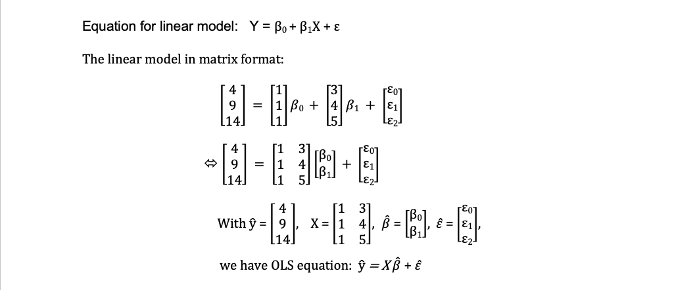
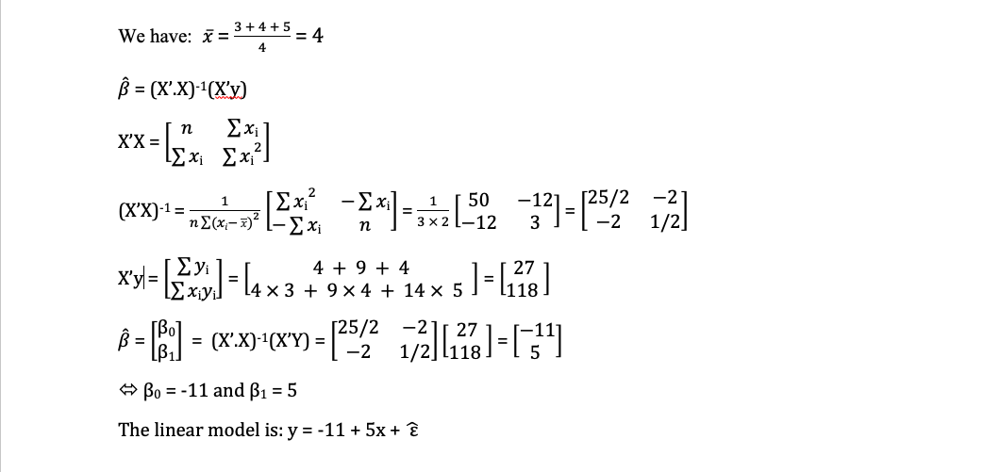
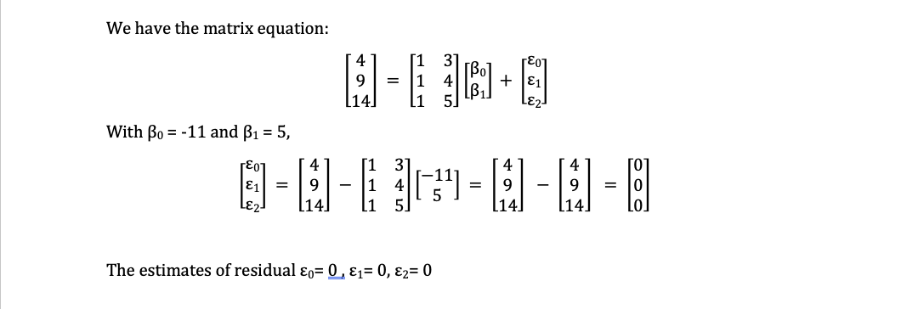

```{r setup, include=FALSE}
knitr::opts_chunk$set(echo = TRUE)
#tinytex::install_tinytex()
```
#Question 1:
##(a)

Equation for linear model:
#Y = B0 + B1X + e 
The linear model in matrix format:
```{r, fig.cap="A caption", out.width = '100%'}

```

```{r, fig.cap="A caption", out.width = '100%'}

```

##(b)

```{r, fig.cap="A caption", out.width = '100%'}

```

##(c)

Original Least Squares:
#Y = XB + e 

```{r}
#Create 2 vectors x and y

x <- c(3,4,5)
y <- c(4,9,14)

#create matrix X and Y:
v1 <- rep(1,3)
X <- matrix(c(v1, x), nrow = 3, ncol = 2, byrow = FALSE)
Y <- matrix(y, nrow = 3, ncol = 1)

#Find vector B

B <- solve(t(X)%*%(X))%*%(t(X)%*%Y)

B
```

Find the residuals e:

```{r}
# Find the residuals e:

E <- Y - X%*%B

E
```
as we can see, the values of vector E is extremely small, so the result is E <- c(0, 0, 0)

##(d) Estimate the coefficients using the function lm in R

```{r}
#Linear regressison model:

Lm_model <- lm(y~x)
summary(Lm_model)

```

As we can see that the B0 is approximately -11 and B1 is approximately 5.

#Question 2:

##(a) What happens to the coefficient estimates?

```{r}
#Create 2 vectors x and y

x_2 <- c(2,2,2)
y <- c(4,9,14)

#create matrix X and Y:

X <- matrix(c(v1, x_2), nrow = 3, ncol = 2, byrow = FALSE)
Y <- matrix(y, nrow = 3, ncol = 1)

#Transpose of matrix X:

print(paste("Transpose of X is: X' = "))
t(X)

#Find X'X:

print(paste("The result X'X = "))
t(X)%*%(X)

#find determinant of X'X:
print(paste("Determinant of X'X = "))
det(t(X)%*%(X))

```
Becase det(X'X) = 0, so X'X is a singular matrix, which is not invertible, thus the linear regression model can not be computed.

##(b) Using appropriate terminology give both a statistical and geomet- ric explanation of this situation.

### Statistical explanation:

The linear regression model involves the matrix of predictors' values (X) and vector of response values (Y). 
The matrix X and vector Y are used to estimate the regression coefficients vector B <- c(B0, B1). 
B = (X'X)^-1 X (X'Y)

When det(X'X) = 0, matrix X'X is singular and have no inverse, therefore the coefficients cannot be computed. This can happen when the some of the predictor variables are linearly dependent on each other. 

In this case, det(X'X) = 0, which mean the matrix X'X is singular, so we cannot estimate the coefficients for this linear model.

### geometric explanation:

```{r}
# Define the starting and ending points of two vectors
x <- c(0, 0) 
y <- c(0, 0)
u <- c(3, 6)
v <- c(6, 12)

# Create a plot with arrows representing the vectors
plot(x, y, xlim = c(0, 8), ylim = c(0, 14), xlab = "x", ylab = "y")
arrows(x, y, x + u, y + v, length = 0.1)
title("det(A) = 0")
text(3,6, "vector (3,6)", pos=4)
text(6,12, "vector (6,12)", pos=4)
text(7,1, "Giang Bui - 37306207", pos=1, col = "blue", cex = 0.7)
```

with matrix X, we have X'X is a 2x2 matrix. X'X = ...

As we can see on the plot, matrix X'X including 2 vectors (3, 6) and (6,12) which are colinear vectors, and the area of the parallelogram defined by 2 vectors is 0, which mean the determinant is 0. 
So X'X do not have an inverse.

#Question 3:

##(a) Using the model summary, state the regression equation for hap- piness.

```{r}
#setwd("~/Dropbox/MADS/STAT448/assignment1")
df <- read.csv("happy.csv")
#inspect the data structure
str(df)
summary(df)
#Check if any NA values in the df
any(is.na(df))
```
```{r}
happiness_model <- lm(happiness ~ income, df)
print(happiness_model)
happiness_summary <- summary(happiness_model)
print(happiness_summary)
```

The regression equation for happiness:
happiness = 0.204 + 0.714 * income
where "income" is predictor variable and "happiness" is the response variable. The model's Intercept estimated is 0.204 and the slope estimated is  0.714 (round up to 3 decimal places).


##(b) Using the B1 coefficient from the model equation, provide an in- terpretation of this coefficient in relation to the response variable.

```{r}
# model coefficients
modelCoeffs <- happiness_summary$coefficients
modelCoeffs

# get beta estimate for income
beta.estimate <- modelCoeffs["income", "Estimate"]
beta.estimate
# get std.error for income
std.error <- modelCoeffs["income", "Std. Error"]
std.error

```
#As we can see, the coefficient B1 = 0.714, which means with $10,000 increase in income, the expected happiness score increase is 0.714 unit.
Std.Error, the different between the actual and expected happiness score, is 0.019 .
##(c) Using the model summary, does income have a significant effect on happiness? Justify your answer.

```{r}
# get p-value estimate for income
beta.pvalue <- modelCoeffs["income", "Pr(>|t|)"]
beta.pvalue
# model F statistic:
fstat <- happiness_summary$fstatistic
fstat

```

#Yes. As we can see from the model summary, the coefficient B1 = 0.714 with p-value <2e-16 which is extremely small, which indicates that the relationship between income and happiness is statistically significant.
On the other hand, the model's F-statistic is 1483 with p-value < 2.2e-16, which is extremely small, which means the income is an important predictor for happiness outcome. 
In conclusion, the income has a significant effect on happiness in this model.

##(d) Again using the model summary, does your model provide a good fit for the observed data?

```{r}
# model R-squared
r.squared <- happiness_summary$r.squared
r.squared

# model's rse:
rse <- happiness_summary$sigma
rse
```

By examining the happiness model summary, we can evaluate the model's  goodness-of-fit with the "R-squared" and "residual standard error" values.

In the model, R-squared = 0.7493, which means that predictor "income" can address approximately 74.93% of the change in happiness, which means the model provide a reasonably good fit for the happiness data. However, there may be other factors that can also affect the happiness that were not included in the model.

Residual Standard Error (RSE) = 0.7181, which means the there is relatively small amount of variability in outcome "happiness" can not be explained by the predictor "income". Therefore, the model provides a good fit for the observed data.

In conclusion, the model provides a good fit for observed data.

## (e) Validate your regression model using appropriate residual plots. What do you observe. Is the fit adequate? Do the residuals suggest a better fit is possible?

```{r}
scatter.smooth(x=happiness_model$fitted.values,
               y=happiness_model$residuals,
               pch = 16, col = "aquamarine3", cex = 0.7,
               xlab = "Fitted values", ylab = "Residuals",
               main = "Residuals Against Predicted Values")
lines(lowess(happiness_model$fitted.values,happiness_model$residuals, f=2/3), lwd=2, col="red") 
```
As we can observe from the plot, the residuals are not showing any systematic patterns or trends and are randomly scattered around 0 (constant variance = 0).
It is confident to say that the model produces a desirable outcome, or the model is providing a good fit for the data.
As we do not see any curve or a funnel shape, and the residuals are randomly distributed around the constant variance. So, the desirable fit is met and we may not need to seek a better fit for this data.

## (f) Provide a well labelled plot of the observations, also include the regression line and regression equation.

```{r}
library(ggplot2)
ggplot(df, aes(x = income, y = happiness)) +
  geom_point(col = "blue", cex = 0.8) +
  geom_smooth(method = "lm", col = "red", lwd = 0.5) +
  ggtitle("Happiness Linear Regression Model Fit") +
  xlab("Income ($10,000)") +
  ylab("Happiness score") +
  annotate("text", x = 2.2, y = 7, 
           label = paste0("y = ", round(coef(happiness_model)[1], 3), 
                          " + ", round(coef(happiness_model)[2], 3), "x")) +
  geom_text(x = 7, y = 0.2, label = "Giang Bui - 37306207", cex = 3, 
            col = "darkgreen")
```

## (g) Using your regression equation, make Happiness predictions for the following income values, 2.75, 5.75, and 8.75 (to 2 decimal places). Why might it not be valid to make predictions outside the income range in your data?

```{r}
x1 <- 2.75
x2 <- 5.75
x3 <- 8.75

y1 <- round(coef(happiness_model)[1] + coef(happiness_model)[2] * x1,2)
y2 <- round(coef(happiness_model)[1] + coef(happiness_model)[2] * x2,2)
y3 <- round(coef(happiness_model)[1] + coef(happiness_model)[2] * x3,2)

print(paste("x1 = 2.75, y1 = ", y1))
print(paste("x2 = 5.75, y2 = ", y2))
print(paste("x3 = 8.75, y3 = ", y3))
```

The predicted happiness scores for income = 2.75, 5.75 and 8.75 are 2.17, 4.31 and 6.45 respectively.

There are several reasons why it may not be valid to make predictions outside the income range in your data:
-It may lead to extrapolation phenomenon. The model may not produce an accurate predicted outcomes that fall outside the range of the data. For example, the maximum happiness score can be reach is 10. If we get income is more than 13 unit, the happiness will exceed 10 which is not a desirable result.
- Because the model only used predictor 'income' values ranging from 1.506 to 7.482, it may not be able to accurately predict the full range of variability in the population. This limitation can result in predictions that are biased when attempting to predict values outside the range of the data.


